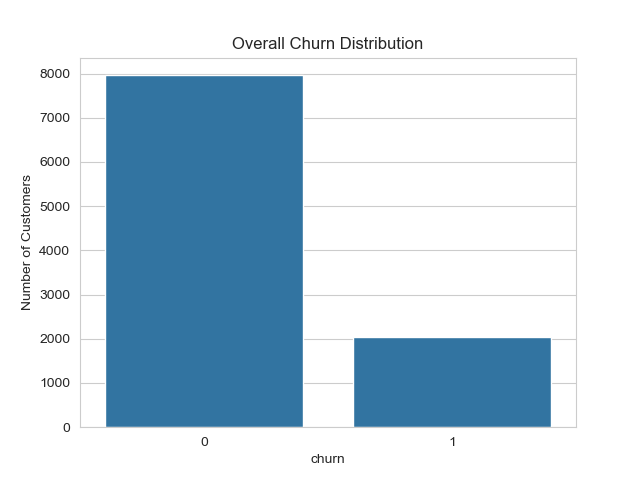
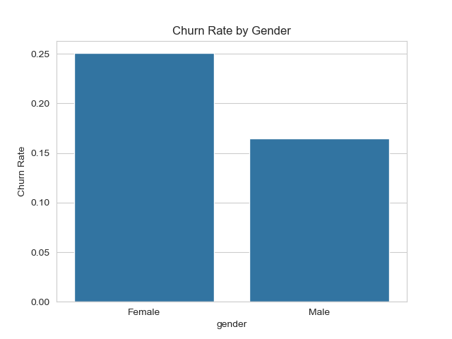
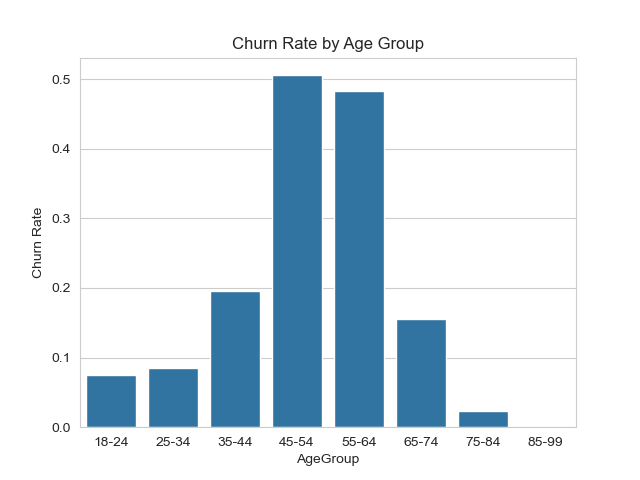
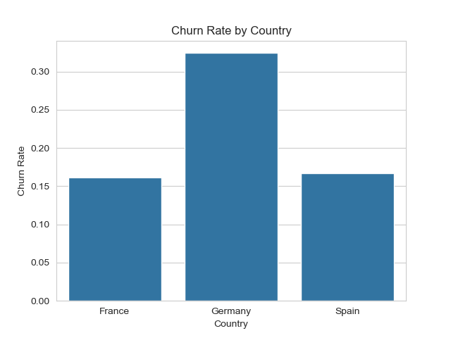
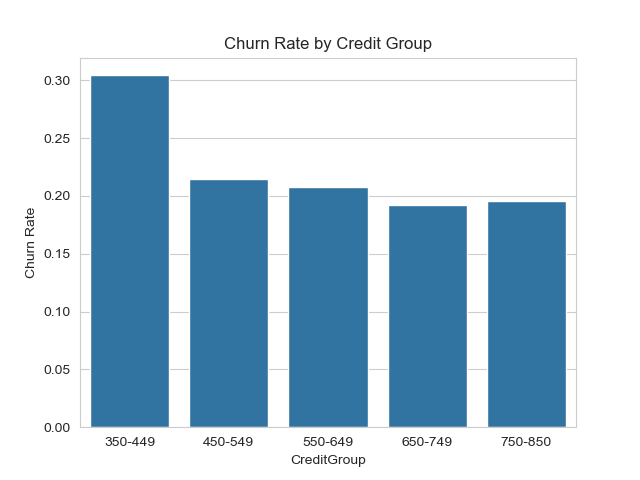
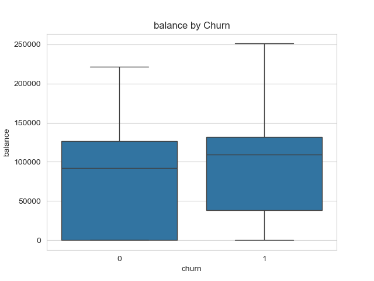
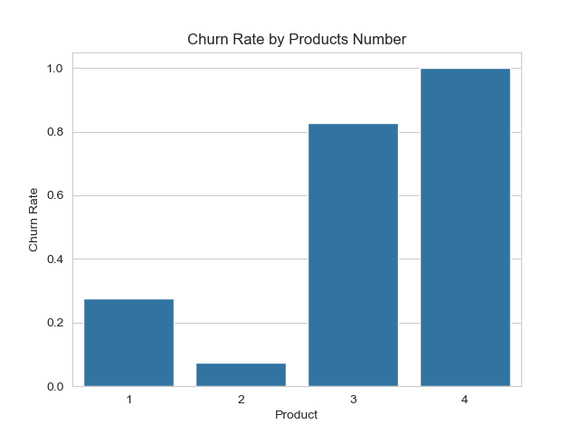

# Bank Customer Churn Analysis

## Overview
This project analyzes bank customer data to identify patterns that contribute to customer churn. The goal is to provide insights and actionable recommendations to reduce churn and improve customer retention.

## Dataset
- Source: [Bank Customer Churn Dataset](https://www.kaggle.com/datasets)
- Features include:
  - Customer demographics
  - Account details
  - Churn indicator

## Project Steps
1. **Data Cleaning & Preprocessing**
   - Checked for missing or inconsistent values

2. **Exploratory Data Analysis (EDA)**
   - Visualized churn by demographics and account features
   - Created bar plots and boxplots to identify patterns

  #### Key Charts:

**Churn Rate**  


**Churn by Gender**  


**Churn by Age Group**  


**Churn by Country**  


**Churn by Credit Score**  


**Churn by Balance**  


**Churn by Products Number**  


**Churn by Active Member**  


3. **Insights & Recommendations**
   - Identified churn rate trends by data provided 
   - Suggested strategies for reducing churn:

## Key Findings
- Around 1 in every 5 customers is currently churning
- Female customers are more likely to churn as well as ages 45-64
- Customers with credit scores on the lowest ends are more likely to churn
- Germany has the most customers churning currently
- Customers with slightly higher balances are churning more frequently
- Customers utilizing products 3 and 4 are more likely to churn
- Non-active customers are churning more frequently than active customers

**Recommendations:**
- Investigate and survey female customers aged 45-64 to understand why they are churning more frequently
- Advertise to potential customers with higher credit scores
- Offer incentives for German customers to continue services
- Research into what is lacking in products 3 and 4 and why these are potentially causing more churn
- Conduct target marketing to non-active customers to promote them to active customers
  
## Tools Used
- Python (pandas, matplotlib, seaborn)
- Jupyter Notebook
- GitHub for version control

## How to Use
1. Clone the repo:  
   ```bash
   git clone https://github.com/hopeswright-png/bank-customer-churn-analysis.git
